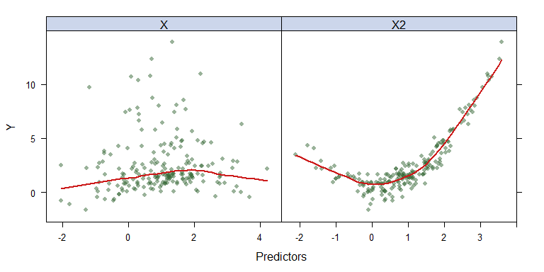

Cross-validation and Bootstrapping
================
Yifei Sun
2/4/2020

``` r
library(FNN)
library(ModelMetrics)
```

    ## 
    ## Attaching package: 'ModelMetrics'

    ## The following object is masked from 'package:base':
    ## 
    ##     kappa

``` r
library(caret)
```

    ## Loading required package: lattice

    ## 
    ## Attaching package: 'caret'

    ## The following objects are masked from 'package:ModelMetrics':
    ## 
    ##     confusionMatrix, precision, recall, sensitivity, specificity

    ## The following object is masked from 'package:purrr':
    ## 
    ##     lift

``` r
library(boot)
```

    ## 
    ## Attaching package: 'boot'

    ## The following object is masked from 'package:lattice':
    ## 
    ##     melanoma

``` r
library(Rcpp)
library(microbenchmark)
```

# Cross-validation

You can generate a simulated training dataset or use an existing
dataset. For illustration, we use a simulated dataset with two
predictors.

``` r
# Data generating function - you can replace this with your own function
gen_data <- function(N)
{
  X <- rnorm(N, mean = 1)
  X2 <- rnorm(N, mean = 1)
  eps <- rnorm(N, sd = .5)
  Y <- sin(X) + (X2)^2 + eps
  data.frame(Y = Y, X = X, X2 = X2)
}

set.seed(2020)
# generate the training data
N <- 200
trainData <- gen_data(N)
```

The function `featurePlot()` in `caret` is a wrapper for different
lattice plots to visualize the data. The various graphical parameters
(color, line type, background, etc) that control the look of Trellis
displays are highly customizable. You can explore `trellis.par.set()`
after class.

``` r
theme1 <- trellis.par.get()
theme1$plot.symbol$col <- rgb(.2, .4, .2, .5)
theme1$plot.symbol$pch <- 16
theme1$plot.line$col <- rgb(.8, .1, .1, 1)
theme1$plot.line$lwd <- 2
theme1$strip.background$col <- rgb(.0, .2, .6, .2)
trellis.par.set(theme1)

featurePlot(x = trainData[,(2:3)], 
            y = trainData[,1], 
            plot = "scatter", 
            span = .5, 
            labels = c("Predictors","Y"),
            type = c("p", "smooth"),
            layout = c(2, 1))
```



### The validation set approach

The function `createDataPartition()` creats test/training or
test/validation partitions.

``` r
trRows <- createDataPartition(trainData$Y,
                              p = .75,
                              list = FALSE)

fit_lm <- lm(Y~., data = trainData[trRows,])
pred_lm <- predict(fit_lm, trainData[-trRows,])

pred_knn1 <- knn.reg(train = trainData[trRows,2:3], test = trainData[-trRows,2:3], 
                     y = trainData$Y[trRows], k = 5)
  
pred_knn2 <- knn.reg(train = trainData[trRows,2:3], test = trainData[-trRows,2:3], 
                     y = trainData$Y[trRows], k = 20)

# validation set errors
mse(trainData$Y[-trRows], pred_lm)
```

    ## [1] 4.393063

``` r
mse(trainData$Y[-trRows], pred_knn1$pred)
```

    ## [1] 1.597088

``` r
mse(trainData$Y[-trRows], pred_knn2$pred)
```

    ## [1] 2.161979

### K-fold CV

#### Approach 1

The function `createFolds()` splits the data into k groups. `returnTrain
= TRUE` means the values returned are the sample positions corresponding
to the data used during training.

``` r
cvSplits <- createFolds(trainData$Y, 
                        k = 10, 
                        returnTrain = TRUE)

str(cvSplits)
```

    ## List of 10
    ##  $ Fold01: int [1:180] 1 2 3 4 5 6 7 8 9 10 ...
    ##  $ Fold02: int [1:180] 1 2 3 5 6 7 8 9 10 11 ...
    ##  $ Fold03: int [1:180] 1 2 3 4 5 6 7 9 11 12 ...
    ##  $ Fold04: int [1:180] 4 5 6 7 8 9 10 11 12 13 ...
    ##  $ Fold05: int [1:180] 1 2 3 4 6 7 8 9 10 11 ...
    ##  $ Fold06: int [1:180] 1 2 3 4 5 6 7 8 9 10 ...
    ##  $ Fold07: int [1:180] 1 2 3 4 5 6 7 8 9 10 ...
    ##  $ Fold08: int [1:180] 1 2 3 4 5 6 7 8 9 10 ...
    ##  $ Fold09: int [1:180] 1 2 3 4 5 6 7 8 10 11 ...
    ##  $ Fold10: int [1:180] 1 2 3 4 5 8 9 10 11 12 ...

``` r
K <- 10
mseK1 <- rep(NA, K)
mseK2 <- rep(NA, K)
mseK3 <- rep(NA, K)

for(k in 1:K)
{
  trRows <- cvSplits[[k]]
  
  fit_lm <- lm(Y~X+X2, data = trainData[trRows,])
  pred_lm <- predict(fit_lm, trainData[-trRows,])
  
  pred_knn1 <- knn.reg(train = trainData[trRows,2:3], test = trainData[-trRows,2:3], 
               y = trainData$Y[trRows], k = 5)
  
  pred_knn2 <- knn.reg(train = trainData[trRows,2:3], test = trainData[-trRows,2:3], 
               y = trainData$Y[trRows], k = 20)
  
  mseK1[k] <- mse(trainData$Y[-trRows], pred_lm)
  mseK2[k] <- mse(trainData$Y[-trRows], pred_knn1$pred)
  mseK3[k] <- mse(trainData$Y[-trRows], pred_knn2$pred)
}
# K-fold MSE
c(mean(mseK1), mean(mseK2), mean(mseK3))
```

    ## [1] 3.3216416 0.7019225 1.2009105

#### Approach 2 (recommended)

Calculate the 10-fold CV MSE using the function `train()`.

``` r
# 10-fold CV
ctrl1 <- trainControl(method = "cv", number = 10)
# other options
ctrl2 <- trainControl(method = "LOOCV")
ctrl3 <- trainControl(method = "none") # only fits one model to the entire training set
ctrl4 <- trainControl(method = "boot632")
ctrl5 <- trainControl(method = "repeatedcv", repeats = 5) 
ctrl6 <- trainControl(method = "LGOCV") 

set.seed(1)
lmFit <- train(Y~., 
                data = trainData, 
                method = "lm", 
                trControl = ctrl1)
lmFit
```

    ## Linear Regression 
    ## 
    ## 200 samples
    ##   2 predictor
    ## 
    ## No pre-processing
    ## Resampling: Cross-Validated (10 fold) 
    ## Summary of sample sizes: 180, 180, 180, 180, 180, 180, ... 
    ## Resampling results:
    ## 
    ##   RMSE      Rsquared   MAE     
    ##   1.794721  0.5582084  1.328165
    ## 
    ## Tuning parameter 'intercept' was held constant at a value of TRUE

``` r
set.seed(1)
knnFit <- train(Y~., 
                data = trainData, 
                method = "knn", 
                trControl = ctrl1)
knnFit
```

    ## k-Nearest Neighbors 
    ## 
    ## 200 samples
    ##   2 predictor
    ## 
    ## No pre-processing
    ## Resampling: Cross-Validated (10 fold) 
    ## Summary of sample sizes: 180, 180, 180, 180, 180, 180, ... 
    ## Resampling results across tuning parameters:
    ## 
    ##   k  RMSE       Rsquared   MAE      
    ##   5  0.7770823  0.9132068  0.5584896
    ##   7  0.8083915  0.9176244  0.5548943
    ##   9  0.8294284  0.9187135  0.5694860
    ## 
    ## RMSE was used to select the optimal model using the smallest value.
    ## The final value used for the model was k = 5.

To compare these two models based on their cross-validation statistics,
the `resamples()` function can be used with models that share a common
set of resampled data sets.

``` r
resamp <- resamples(list(lm = lmFit, knn = knnFit))
summary(resamp)
```

    ## 
    ## Call:
    ## summary.resamples(object = resamp)
    ## 
    ## Models: lm, knn 
    ## Number of resamples: 10 
    ## 
    ## MAE 
    ##          Min.  1st Qu.    Median      Mean   3rd Qu.      Max. NA's
    ## lm  0.8689219 1.094211 1.2873268 1.3281646 1.5607524 1.8302642    0
    ## knn 0.4439676 0.489103 0.5312808 0.5584896 0.5762977 0.8506558    0
    ## 
    ## RMSE 
    ##          Min.   1st Qu.    Median      Mean   3rd Qu.     Max. NA's
    ## lm  1.0277549 1.4649715 1.7298812 1.7947208 2.1873101 2.508706    0
    ## knn 0.5820103 0.5939501 0.6596212 0.7770823 0.8628396 1.348081    0
    ## 
    ## Rsquared 
    ##          Min.   1st Qu.    Median      Mean   3rd Qu.      Max. NA's
    ## lm  0.1881674 0.3602168 0.6607843 0.5582084 0.7281930 0.8173957    0
    ## knn 0.8323785 0.9044864 0.9120968 0.9132068 0.9389075 0.9579583    0

# Bootstrapping

We consider an example on calculating the standard error for the sample
median.

``` r
set.seed(2020)
# generate a sample
N <- 200
X <- rnorm(N)

# sampling distribution 
B0 <- 1000
med0 <- rep(NA, B0)
for(b in 1:B0)
{
  med0[b] <- quantile(rnorm(N), probs = .5)
}
sd(med0)
```

    ## [1] 0.08700225

### Writing an R function

``` r
quantileRBoot <- function(X, prob = 0.5, B)
{
  med <- rep(NA, B)
  for(b in 1:B)
  {
    med[b] <- quantile(X[sample(x = 1:N, size = N, replace = TRUE)], probs = prob)
  }
  sd(med)
}

quantileRBoot(X,0.5,1000)
```

    ## [1] 0.08029857

### Bootstrap using `boot()`

``` r
fun <- function(dat, ind, prob) 
{
  quantile(dat[ind], probs = prob)
}

med_boot <- boot(X, statistic = fun, prob = 0.5, R = 1000)
sd(med_boot$t)
```

    ## [1] 0.08082919

``` r
boot.ci(med_boot)
```

    ## BOOTSTRAP CONFIDENCE INTERVAL CALCULATIONS
    ## Based on 1000 bootstrap replicates
    ## 
    ## CALL : 
    ## boot.ci(boot.out = med_boot)
    ## 
    ## Intervals : 
    ## Level      Normal              Basic         
    ## 95%   (-0.0886,  0.2282 )   (-0.0592,  0.2576 )  
    ## 
    ## Level     Percentile            BCa          
    ## 95%   (-0.1233,  0.1935 )   (-0.1234,  0.1934 )  
    ## Calculations and Intervals on Original Scale

### Writing a function using `Rcpp` (optional but quite useful)

For simplicity, we use the type 7 definition.

``` r
quantileRcppBoot(X,0.5,1000)


mbm <- microbenchmark(R = quantileRBoot(X,0.5,1000), 
                      Rcpp = quantileRcppBoot(X,0.5,1000), 
                      boot = boot(X, statistic = fun, prob = 0.5, R = 1000),
                      times = 10L)


boxplot(mbm)
```
